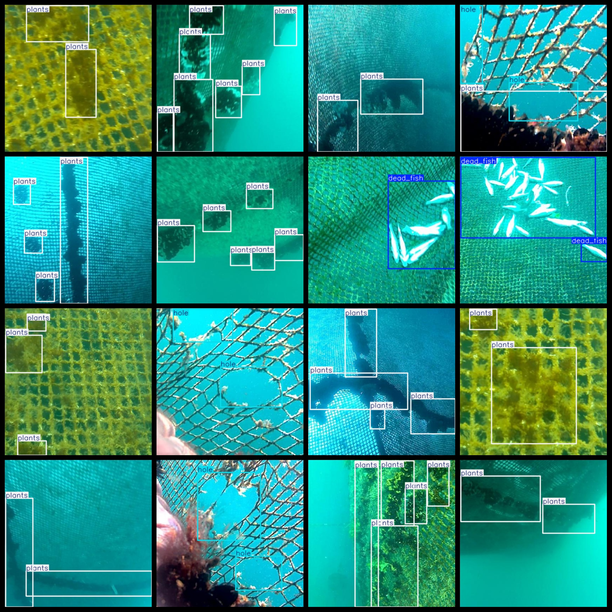

# Underwater Fishing Net Breakage and Intercept Fish Grass Detection Dataset 2017 imagesVOC+YOLO format

Underwater fishing net puncture and intercept fish grass detection dataset for 2017, in Pascal VOC format + YOLO format (excluding txt files with segmentation paths, only including jpg images as well as corresponding VOC format xml files and YOLO format txt files)

Number of Images (jpg file count): 2017

Number of Annotations (xml file count): 2017

Number of Annotations (txt file count): 2017

Number of Annotation Categories: 3

Repository: datasets_sl

Annotation Category Names (Note that the order of categories in the YOLO format does not correspond to this, but is based on the classes.txt in the labels folder): ["dead_fish", "hole", "plants"]

Box Count per Category:

dead_fish boxes = 276

hole boxes = 419

plants boxes = 5164

Total Boxes: 5859

Images per category:

dead_fish images = 158

hole images = 323

plants images = 1628

Image Resolution: 416x416

Annotation Tool Used: labelImg

Dataset Enrichment: Yes

Annotation Rules: Draw a box around the category

Important Note: The dataset does not have been split into training, validation, and test sets; you need to do so yourself

Special Remarks: This dataset does not guarantee the accuracy of the trained models or the weight files

Annotation and Image Details:

## Images

---

Here is a pay link on Stripe (https://buy.stripe.com/3cs8yP7sY87d0vu9AB). Please contact me lonlonago@foxmail.com after funding $89, and I will send you a complete data files, thank you!

